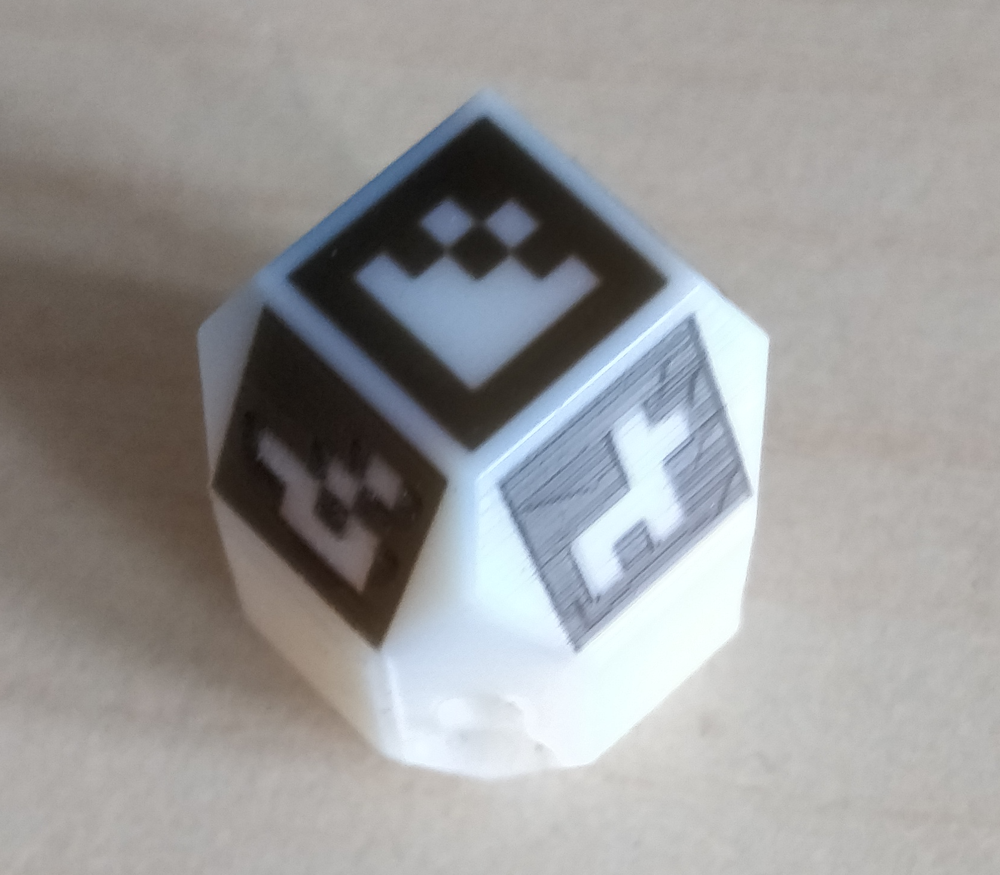
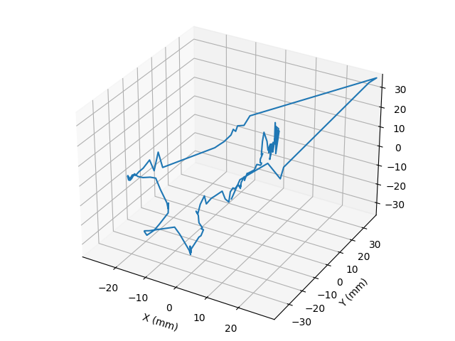

# Repository for 3D tracking of a tracking die
## Preparation
1. The cad files for 3D printing is located in the [cad-folder](cad).
2. Film a video where the tracking device is used in surgery.



## Camera calibration
1. Print the [CalibrationGrid.png](calibration/CalibrationGrid.png)
2. Take at least 10 sharp images of the grid from different angles. 
3. Save the images in a separate folder.
4. Run the calibration script [calibrate.py](calibration/calibrate.py).
```
python3 -f <path_to_image_folder> -o <yaml_file> [-sz size_of_one_square_in_calibration_grid]
```
5. This will save the camera calibration in the yaml-file. 

## Analyze the video
1. Run the [log_in_video.py](log_in_video.py) script to track the 3D printed die in the video. Arguments to the scripts are:
- the video from the surgery: -v, --video 
- the yaml-file with the camera calibration: -cd, --camera_data 
- the name of an output video where the identified markers will be showed: -o, --out_video
- a log-file for storing the position data: -l, --log 
- optionally, the minimum number of markers that must be visible: -mn, --min

```
python3 log_in_video.py -v <path_to_video> -cd <camera_calibration_yaml_file> -o <output_video> -l <log_file> -m <minimum required sides>
```
2. Analyze the data, e.g., plot the position. The [plot_pos.py](plot_pos.py) script will draw the positions recorded in an interval of __sz__ frames. 
```
python3 plot_pos.py -l <log> -sz <interval_size>
```




## Calculate the F1 score
Calculates the F1 score for visibility. 
1. Generate data for the visibility score by running the [gen_data_f1.py](F1_score/gen_data_f1.py). The scripts takes up to four arguments:
- The video from the surgery: -v, --video
- The yaml file with camera calibration parameters: -cd, --camera_data
- An output video for saving the tracking result: -o, --out_video
- A log file to save the result: -l , --log
- An optional argument to show or hide the video while it is processing, default is to show: -s, --show
```
python3 gen_data_f1.py -v <path_to_video> -cd <camera_data_yaml> -o <output_video> -l <log> -s False
```
2. The script [label.py](F1_score/label.py) is used to label images as either correctly or incorrectly SEEN or UNSEEN. A random 1000 images (with a fixed seed) are selected from the video. The program iterates through the images one-by-one displaying each for 1 s before moving to the next. First the frames where the die is visible is displayed with the detected Aruco markers drawn, the last frame is shown for 10 s before moving on to image frames where the die is __not__ detected. 

The program can be controlled with the follwoing keys:
- space: pauses and starts the images slide show
- __B__: when the program is paused, pressing __B__ goes back one frame at the time
- __N__: when the program is paused, pressing __N__ goes forward to the next frame one frame at the time
- __W__: labels the image as __wrong__. 

The workflow is as following:
a. Start the program
b. When an incorrect classified image is shown, press __SPACE__.
c. Navigate back and forth with __B__ and __N__ to find select the incorrectly classified image. 
d. Press __W__ to label the image as incorrect. 
e. Press __SPACE__ to continue. 

The script has three arguemtns:
- The marked video from step 1: -v, --video
- The log file from step 1: -l, --log
- The output file for the labels: -r, --labels
```
python3 lables.py -v <marked_video> -l <log> -r <result_labels>
```

2. The script [calc_f1_score.py](F1_score/calc_f1_score.py) calculates the precision, recall and F1 score from the result label file (the only argument).
```
python3 calc_f1_score.py result_label_file
```

